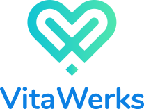

#  VitaWerks App

## **Setting up the development environment**

Follow React Native CLI Setup
https://reactnative.dev/docs/environment-setup

### Environment files

Get .env files from DevOps **-or-** Create from `.env.template`

### Versioning

- `yarn version [--major | --minor | --patch | --release]`
- follow methods in https://classic.yarnpkg.com/en/docs/cli/version

## Running Application

Clone the repo

Install dependencies with `yarn install`

Start the dev server with `react-native start`

Run with `ENVFILE=.env.development react-native run-android`

- **Get credentials from dev**
  ```
  keyAlias
  keyPassword
  storeFile
  storePassword
  ```

## CICD Trigger

- **For Staging Android/iOS**
  ```
  Push code to main branch
  ```
- **For Staging and QA Android/iOS together**
  ```
  After commiting the code. Use the Command "yarn version patch/minor/major".
  ```
- **For UAT Android/iOS**
  ```
  First commit the code
  ```
  ```
  then Use the Command "yarn version patch/minor/major", it generates a Staging and QA build with a tag.
  ```
  ```
  Approach Mobile Team Lead or Devops Team Lead to trigger the UAT build.
  ```
- **For PROD AndroidiOS**
  ```
  First commit the code to main branch.
  ```
  ```
  Then approach Mobile Team Lead or Devops Team Lead to trigger the PROD build.
  ```
